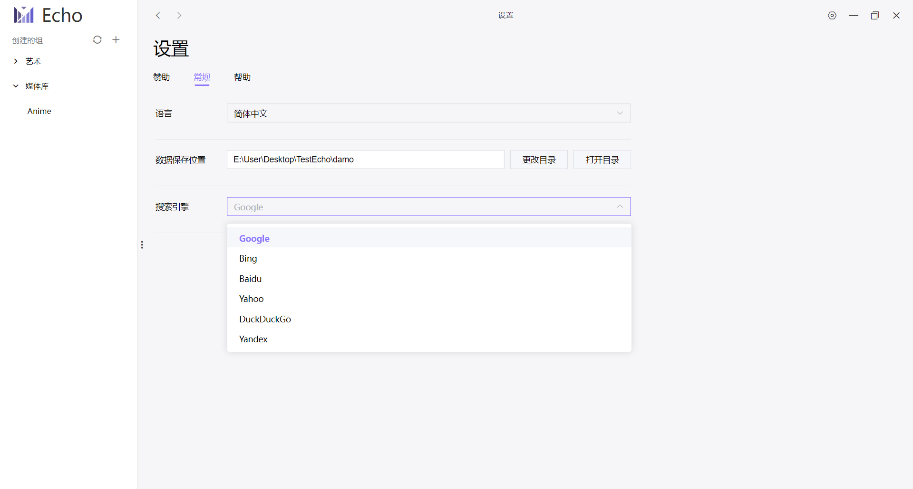

  

# [Echo](https://github.com/Sorceresssis/Echo)

_一款强大的信息记录软件_

  
  

## 介绍

**Echo** 是一款强大的信息记录软件，为用户提供了便捷的方式来管理他们的数据和信息。用户可以为每个记录添加网络链接或者指向本地资源的路径，使信息的组织和访问更加高效。

## 特点

1. **不依赖本地数据资源：**

Jellyfin、emby 这些个人媒体工具都需要本地有媒体文件才构建库。Echo 不要求用户将记录绑定到本地路径，而是允许用户在互联网上搜索记录的标题或者添加一个网络链接，将整个互联网作为您的数据库。

2. **多维度信息管理：**

每个记录都可以添加 `标签` 、 `作者`、`作者角色` 等信息，使用户能够进行高效的数据检索。

您还可以为记录添加封面，提供更直观和可视化的展示效果。

3. **集中管理分散的数据：**

Echo 能够将分散在不同路径下的数据整合在一起，使用户更方便地访问数据。

即使这些文件被移动到不同的位置，只需更新文件所在目录就可以完成全部的文件位置更新。

4. **自由导入和导出数据：**

您可以自由导入和导出数据，以便与他人分享、备份或迁移数据。

## 使用案例

1. **建立个人媒体库和收藏夹：**

利用 Echo，您可以轻松创建个人媒体库和收藏夹，集中管理您喜欢的内容，无论是漫画、电影或其他媒体。

2. **管理喜欢的网页内容：**

在浏览网站时，您可能会发现有趣的内容，但某些网站可能不提供强大的收藏功能，或者您的喜欢的内容分散在多个网站上。Echo 可帮助您记录网页链接、添加封面和标签，以便更轻松地找到所需内容。此外，考虑到网络上的内容可能会被删除，Echo 还可以帮助您有效地管理下载的内容，确保随时访问。

## 注意事项

1. **记录数量建议在 20 万以内：**

因为 Echo 面向的是个人用户，个人用户通常更看重搜索结果的精确性且数据量不大。在没有优秀的多语言分词器的情况下使用倒排索引搜索精确度不高。所以 Echo 的搜索是依靠遍历每个数据来实现的。记录量越多，搜索的就越慢。

如果记录实在太多，可以创建一个新库

## 截图

**记录**

有两种显示方式，一种是 `thumbnail` 、另一种是 `extended`.

记录卡片有四个按钮，功能分别是：`浏览器搜索标题` 、`打开绑定的超链接` 、`打开绑定本地位置`、`在新窗口打开详情页` .

**记录详情页**

**作者列表**

可以根据 role 来分类。

**Tag 列表**

**数据管理页**

**设置页**

