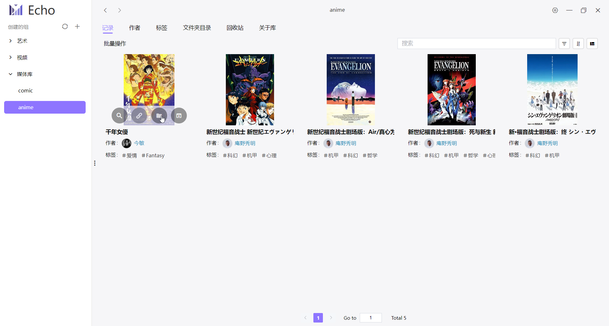
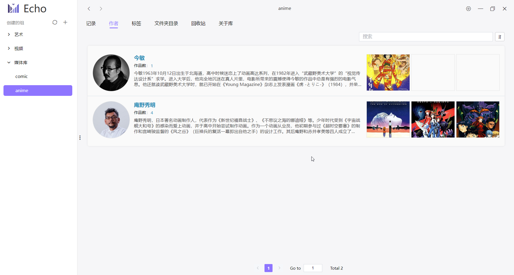
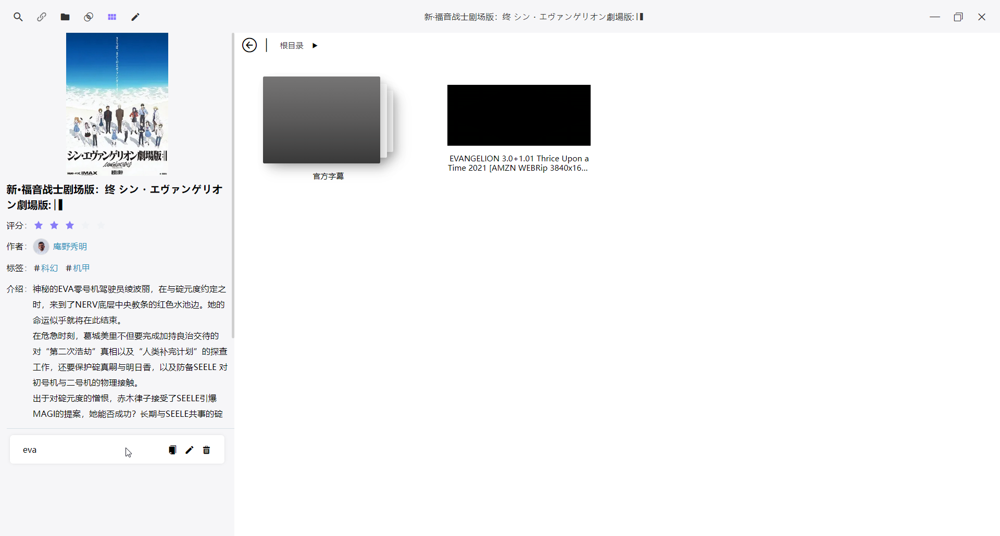
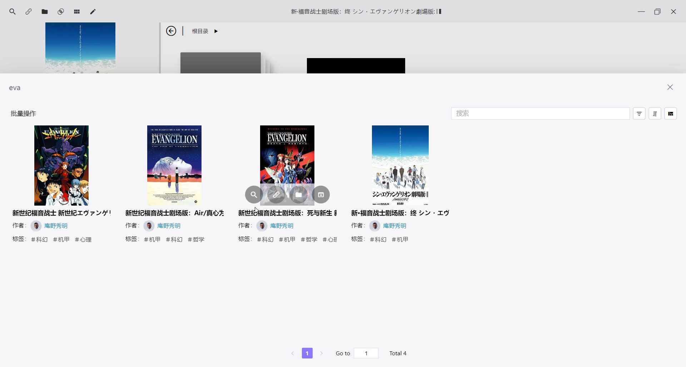
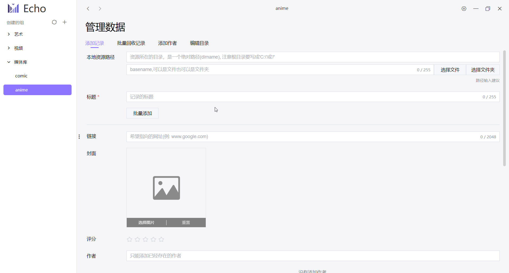

<h1 align="center">Echo</h1>

#### 介绍

**Echo** 是一款强大的信息记录软件，为用户提供了便捷的方式来管理他们的数据和信息。用户可以为每个记录添加网络链接和指向本地资源的路径，使信息的组织和访问更加高效。

#### 特点

1. **不依赖本地数据资源：** Echo 不要求用户将记录绑定到本地路径，而是允许用户在互联网上搜索记录的标题或者添加一个网络链接，将整个互联网作为您的数据库。
2. **多维度信息管理：** 每个记录都可以添加标签和作者信息，使用户能够进行高效的数据检索。此外，您还可以为记录添加封面，提供更直观和可视化的展示效果。
3. **集中管理分散的数据：** Echo 能够将分散在不同路径下的数据整合在一起，使用户更方便地访问数据。即使这些文件被移动到不同的位置，只需更新文件所在目录即可。
4. **自由导入和导出数据：** 您可以自由导入和导出数据，以便与他人分享、备份或迁移数据。

#### 使用案例

1. **建立个人媒体库和收藏夹：** 利用 Echo，您可以轻松创建个人媒体库和收藏夹，集中管理您喜欢的内容，无论是漫画、电影或其他媒体。
2. **管理喜欢的网页内容：** 在浏览网站时，您可能会发现有趣的内容，但某些网站可能不提供强大的收藏功能，或者您的喜欢的内容分散在多个网站上。Echo 可帮助您记录网页链接、添加封面和标签，以便更轻松地找到所需内容。此外，考虑到网络上的内容可能会被删除，Echo 还可以帮助您有效地管理下载的内容，确保随时访问。

#### 注意事项

1. **记录数量建议在 20 万以内：** 因为Echo搜索的实现原理是去遍历所有的数据，记录量越多，搜索的就越慢。如果记录实在太多，可以创建一个新库。这是因为Echo 面向个人用户，数据量通常不会很大。个人用户通常更看重搜索结果的精确性，而高效的查找方法可能会降低精确度。

#### 截图

<div style="
		display: grid;
		justify-content: space-around;
		column-gap: 2%;
		row-gap: 25px;
		grid-template-columns: repeat(auto-fill, 48%);">
    
    
    
    
    
    
</div>

#### 编译 better-sqlite3

```
npm install
npm install -g node-gyp

node_modules/.bin/electron-rebuild -f -w better-sqlite3
```

#### 使用教程

[普通用户](./docs/user-guide/index.md)
